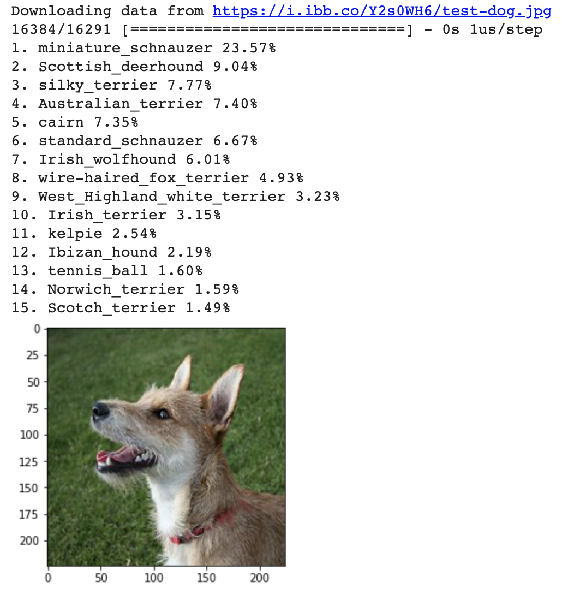

## Introduction

### What is machine learning?

'Machine learning' is what we call computer programs that get better through experience: testing a solution, measuring its success somehow, and then changing it and testing again, over and over, always trying to improve that measurement of success. While there are lots of different kinds of machine learning, this project focuses on **image classifciation** — taking an image and recognising which class, of a number of classes of image the computer has been taught to recognise, the supplied image is most likely to belong to.

One of the most famous examples of this can tell you whether a picture contains a cat, or a dog. The computer can do this because it has been shown thousands, of examples of what cats and dogs look like. From these, it builds a **model** — a set of rules for how to decide that an image contains a dog or a cat. It's important to note an image classification model trained only on cats and dogs will *always* guess that something is either a cat or a dog. These models can't recognise things they haven't been trained to recognise, and they can't decide that none of those things is in the image they're asked to classify.

### What you will make
You will create a Python function for testing a computer's recognition of an object by supplying a photograph of that object and getting back the computer's guess at what it is. This will be a useful tool for you in future projects, to test the models you create and to get the results of others' models when using them as part of an application.

--- collapse ---
---
title: What you should already know
---
This project assumes you already know some Python. Specifically, it assumes you know how to use:

+ Variables
+ Lists
+ Functions, including creating your own function that accepts arguments

--- /collapse ---

--- collapse ---
---
title: What you will need
---

+ A computer
+ An internet connection
+ A Google account

--- /collapse ---

--- collapse ---
---
title: What you will learn
---

+ What machine learning is
+ What a 'model' is, in the context of machine learning
+ How the limitations of machine learning might impact your project

--- /collapse ---

--- collapse ---
---
title: Additional information for educators
---

If you need to print this project, please use the [printer-friendly version](https://projects.raspberrypi.org/en/projects/testing-vision/print){:target="_blank"}.

[Here is a link to the resources for this project](http://rpf.io/testing-vision-go).

--- /collapse ---
