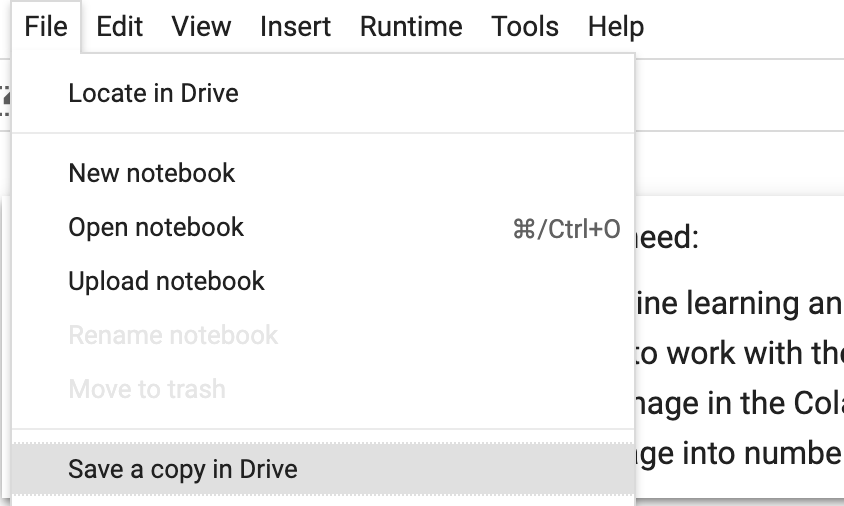
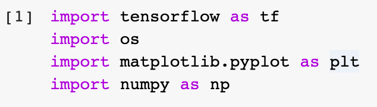

## Get started with Google Colab

Machine learning needs a lot of data, and a lot of computer processing power. Since most personal computers are going to be slow to train a model, and most internet connections might be slow to download large enough amounts of data to train it with, we're going to use Google Colab — an online tool for writing and running machine learning code with the Tensorflow library. This will let us use Google's much more powerful computers, and faster internet connection.

--- task ---

Make sure you have your Google account username and password.

If you don't have an account, you may be able to use a parent's account, [they may be able to create one for you](https://support.google.com/families/answer/7103338) or, if you're old enough to do so under your country's laws, you can [create your own account](https://accounts.google.com/signup).

--- /task ---

--- task ---

Open the [starter](https://colab.research.google.com/drive/12KHBw8tn3s9NkcXXUK2MdhC9hLpHAxLs?usp=sharing) for this project in a new tab in your browser. 

--- /task ---

This is your first Google Colab **notebook**. Notebooks allow you to store text, code, and the output of that code together. This can be useful for keeping notes to remind yourself of what your code is doing at different points, or to add notes for other people who may be looking at your work in future.

This notebook already has some code and text in it, to take care of a few things you don't need to worry about just now: loading the image you want to identify, and taking the outputs from the model you're using and displaying them in a human-readable way.

--- task ---

Before you start changing anything, make sure you save the notebook to your drive so you can keep your work! Choose `File > Save a copy in Drive` and sign in to your Google account if prompted.

--- /task ---

The code and text in the notebook is broken up into **cells**. Each code cell can be run separately, but you're not going to need to do that in this project. You're just going to need to run them all, in order.

--- task ---

Check that you can run all the code in the notebook by going to the `Runtime` menu and choosing `Run all`.

--- /task ---

You should see spinners appear in the code cells, and then see numbers appear in the sqare brackets to the side of the cells. These numbers indicate the oder in which the code was run. 

You'll notice that the last three code cells — the empty ones — all have the same number as the last cell that actually contains code. This is because they're empty right now, so there was nothing new there to run.

