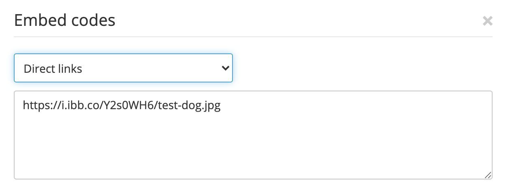

# Experiment with your program

Now that you have a working program to identify images, it's time to have some fun with it!

--- task ---

Try loading a few different images into it to see what predictions it makes. You'll have to use images hosted on the internet. You can use [imagebb](https://imgbb.com/) to put your own images online and then supply the 'direct links' URL to your program. 

You'll also have to make sure they're `.jpg` files, or modify the `get_image_from_url` function I supplied.

--- /task ---
